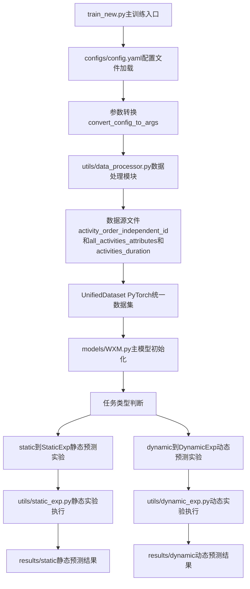
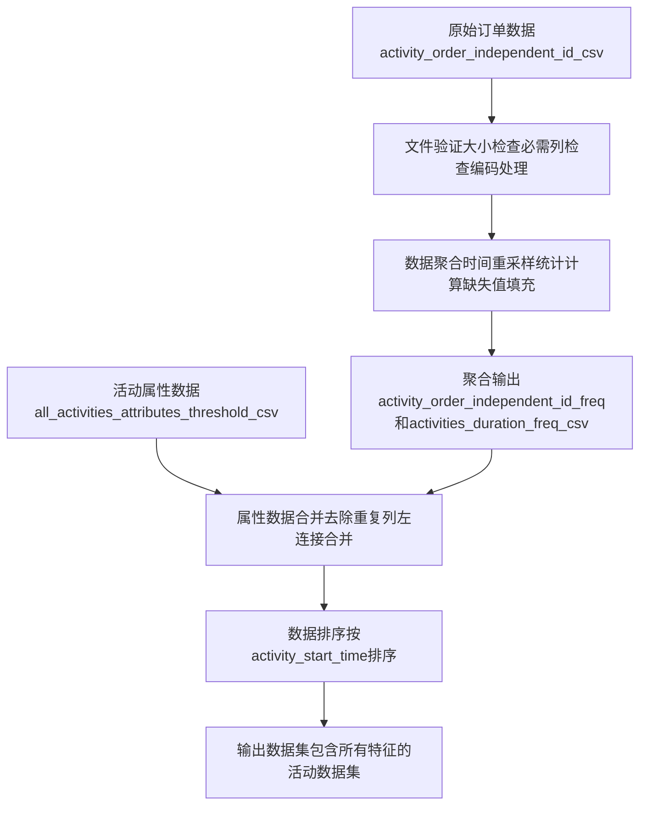
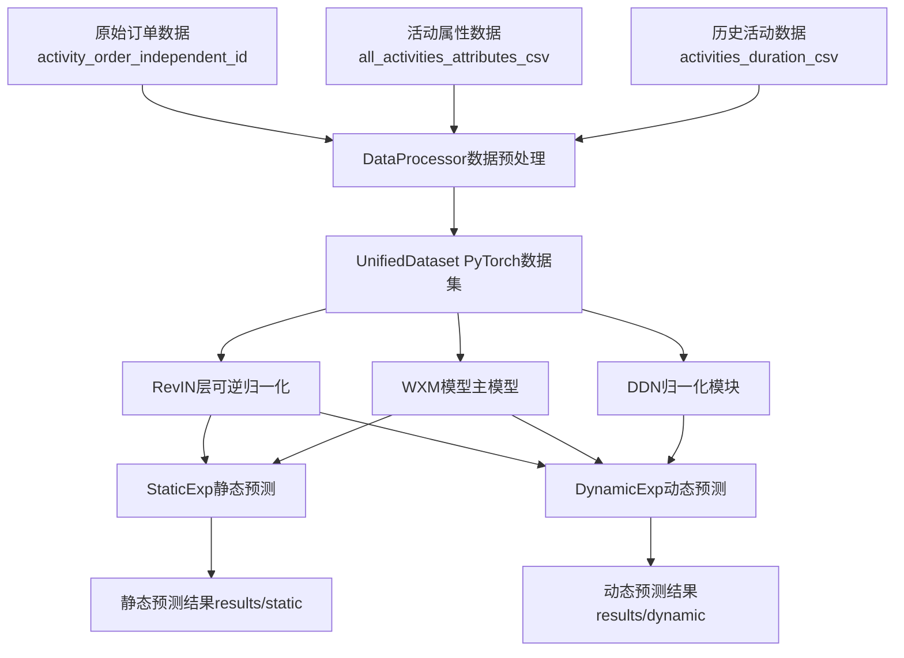

[TOC]

# 多模态活动预测系统 - 专利文档

## 1.预测结果

### 1.1指标结果

#### 表1 静态预测实验结果

|          | **MAE(↓)** |
|----------|---------|
| **user_sum（活跃用户总量）** | **3008.3733** |
| **oc_sum（订单总数）** | **2782.225** |

注：↓表示数值越小越好。静态预测目标为user_sum（用户总数）和oc_sum（订单总数），目标值最大值20w+。

#### 表2 动态预测不同输入输出长度实验结果（以天为步长）

## 表1 动态预测不同输入输出长度组合实验结果

| **输入→输出** | **uc（活跃用户量）** |            | **oc（订单量）** |            |
|---------------|---------------------|------------|------------------|------------|
|               | **MAE(↓)**          | **MSE(↓)** | **MAE(↓)**       | **MSE(↓)** |
| **7→3**       | 76.2345             | 9456.7823  | 85.3421  | 11345.6789 |
| **7→7**       | 90.0744             | 13847.3891 | **75.2156** | 9862.7692 |
| **14→7**      | **71.5074**         | 8936.2574  | 79.1234 | 10862.8912 |
| **14→14**     | 94.7021             | 16834.6789 | 82.4567  | 10784.5623 |
| **21→7**      | 83.2779      | 11234.5678 | 88.7654  | 12334.1245 |

注：表中"输入长度→输出长度"表示使用的历史数据天数和预测未来天数。动态预测目标为uc（用户量）和oc（订单量）。

### 1.2可视化结果

#### 静态预测结果可视化

#### 动态预测结果可视化（输入14天输出7天）

## 2.详细训练流程图

## 3.数据处理详细流程

## 4.数据流向图

